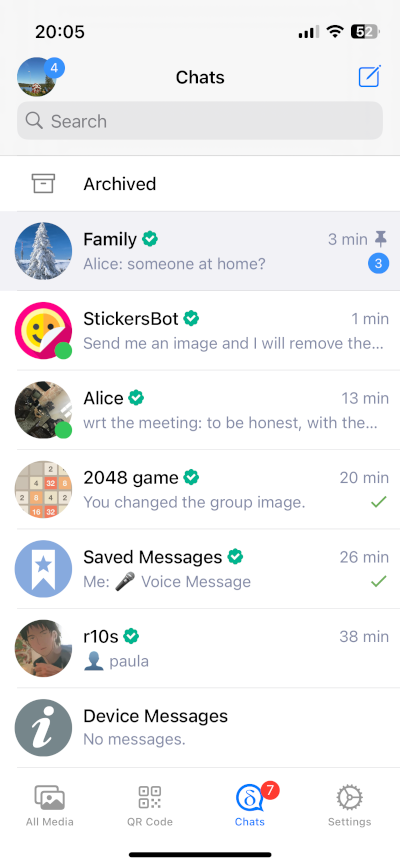
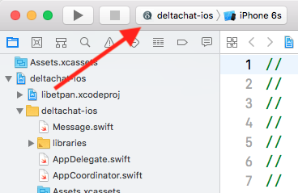
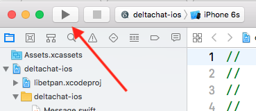

# deltachat-ios

Email-based instant messaging for iOS.

 


## Testing

Betas are distributed via Testflight. Just scan this QR code with the camera app of your iPhone/iPad


or open this link

https://testflight.apple.com/join/uEMc1NxS

on your iPhone or iPad to try Deltachat iOS Beta.

Check the Changelog (for TestFlight builds) at the bottom to see what's included.


## How to build with Xcode

You need to install [rustup](https://rustup.rs/) with rust, as well as [cargo-lipo](https://github.com/TimNN/cargo-lipo#installation).

```bash
$ git clone git@github.com:deltachat/deltachat-ios.git
$ cd deltachat-ios
$ git submodule update --init --recursive
# Make sure the correct rust version is installed
$ rustup toolchain install `cat deltachat-ios/libraries/deltachat-core-rust/rust-toolchain`
$ open deltachat-ios.xcworkspace # do not: open deltachat-ios.xcodeproj
```

This should open Xcode. Then make sure that at the top left in Xcode there is *deltachat-ios* selected as scheme (see screenshot below).



Now build and run - e.g. by pressing Cmd-r - or click on the triangle at the top:



If you're on MacOS Mojave and Xcode complains about missing header files (different mac versions may or may not install all headers),
you can force-install them with the following command:

```bash
$ sudo installer -pkg /Library/Developer/CommandLineTools/Packages/macOS_SDK_headers_for_macOS_10.14.pkg -target /
```

If you get an error about that file not existing, you probably simply don't have the Xcode command line tools installed which can be remedied simply as follows:

```bash
$ xcode-select --install
```

On MacOS Catalina the include paths changed, `/usr/include` doesn't exist anymore. 
You'll need to manually set the `CPATH` variable to specify the location of the header files:

```
export CPATH=/Applications/Xcode.app/Contents/Developer/Platforms/MacOSX.platform/Developer/SDKs/MacOSX.sdk/usr/include
```
Note: the default terminal switched to zsh on MacOS Catalina. All your exported variables have to move to ~/.zshrc


## Running the app on M1 Mac computers

If you want to import/export a backup this is the location you want to put it (import) or retrieve it (export)
```
~/Library/Containers/98CC2CD0-7DED-4E02-9C0A-B4FF287AA877/Data/Documents
```
